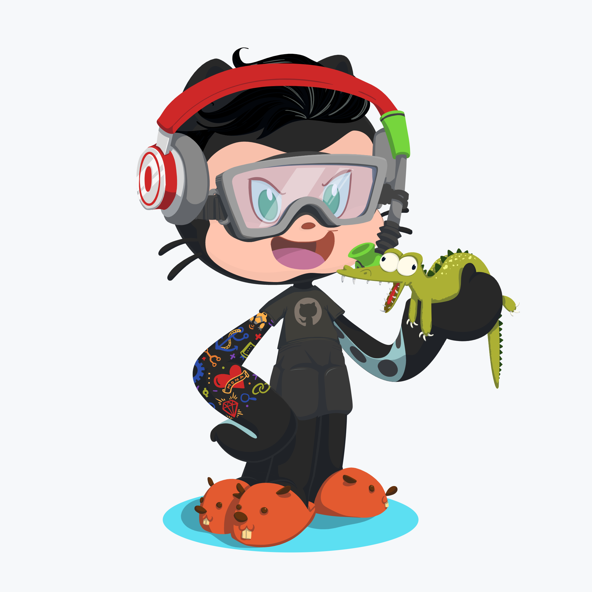

# 🧙‍♂️ E aí dev, beleza?

## 💭 Quem sou eu? 

Meu nome é Leonardo Campello, tenho 19 anos e sou natural do Rio Grande do Sul. Como formação acadêmica sou Técnico em Informática pela [QI Faculdade & Escola Técnica](https://qi.edu.br/), onde obtive muitos fundamentos do desenvolvimento de aplicações e todos processos envolvidos.

Desde minha formação acadêmica não tive muito contato com tecnologia, porém este ano voltei a estudar sobre todo este ecossistema e aos poucos fui percebendo que isso é de fato o que desejo para minha vida, quanto mais aprendo mais eu desejo me tornar um desenvolvedor e poder contribuir com esse grande cenário. Pensando em dar impulso em meus estudos, investi no treinamento [LaunchBase](https://rocketseat.com.br/launchbase) da [Rocketseat](https://rocketseat.com.br/) que tem intuito em guiar o aluno pelas ferramentas e conceitos mais modernos do desenvolvimento web para entrar com pé direito nesse universo.

Em minha pessoa as principais qualidades que eu enxergo são a criatividade, curiosidade, organização e a vontade de fazer algo que mude o mundo. Bom, quem eu sou de verdade? Eu sou uma pessoa um pouco tímida, porém que gosta de conversar e trabalhar em equipe. Alguns dos meus hobbies são jogos, esportes e cozinhar.

## 🧰 Meus conhecimentos  

- [x] **JavaScript** 
- [x] **Node.js** 
- [x] **HTML5 & CSS** 
   
  
- [x] **SQL** 
- [x] **Git & Github** 

## 🦸‍♂️ Precisando de ajuda?  

Estou disponível para ajudar e compartilhar conhecimento. Tenho certeza que ajudando o próximo também vou aprender muito! 

---

 

